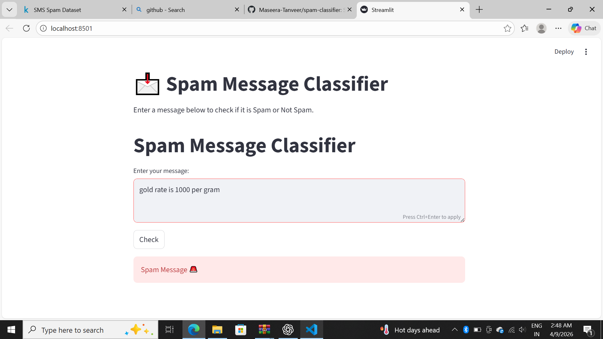

#  Spam Message Classifier

This project is a Machine Learning-based application that classifies messages as **Spam** or **Not Spam** using Natural Language Processing (NLP) techniques.

---

##  Features

- Classifies messages as spam or not spam  
- User-friendly interface built with Streamlit  
- Uses NLP techniques for text processing  
- High accuracy model (~98%)  

---

##  Technologies Used

- Python  
- Scikit-learn  
- Pandas  
- NumPy  
- Natural Language Processing (NLP)  
- Streamlit  

---

##  Model Performance

- Achieved approximately **98% accuracy** on test data  

---

##  How It Works

1. Text preprocessing (cleaning, removing stopwords)  
2. Tokenization of input text  
3. Feature extraction using TF-IDF  
4. Model training using classification algorithm  
5. Predicts whether the message is Spam or Not Spam  

---

##  How to Run the Project

```bash
streamlit run app.py

---

##  Project Screenshot


